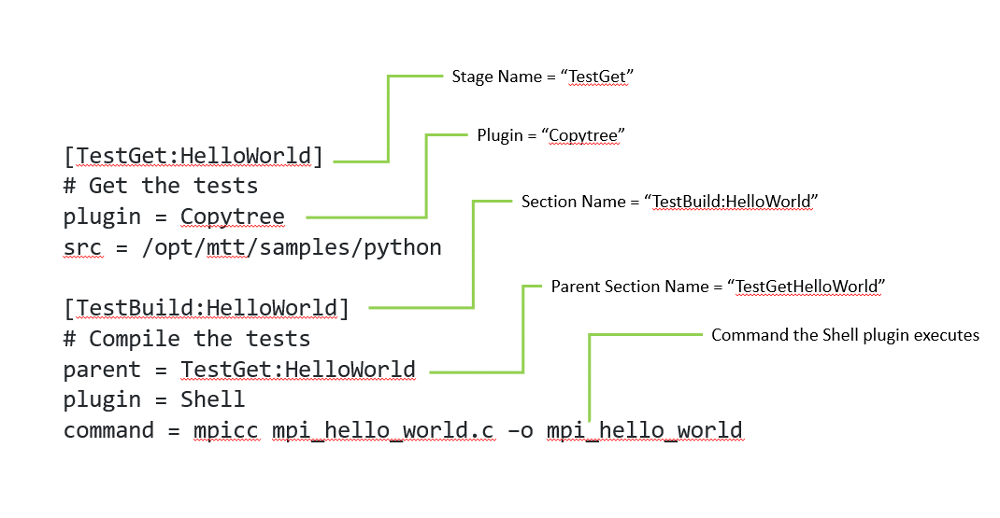

INI Files Overview
----------
MTT uses .ini files as execution scripts. An .ini file is a simple text file with a structure composed of sections, names, and values.

MTT .ini files includes unique features:
 - Sections names with embedded Stage Names
     - Stage names are a nifty mechanism for the test harness to execute stages in a specific order and with a specific purpose

Example:
 

Setup of INI files:
---
The file is split up into sections for each phase plus a global parameters section. Each section is denoted with strings inside brackets and parameters are specified as "key=value" pair.

Stages
---
The 12 MTT stages are executed according to an ordering as shown in the table. The lower the ordering, the sooner the stage is executed.

|Ordering | Stage Name       | Description                                                                                                                                |
| :-----: | :--------------: | ------------------------------------------------------------------------------------------------------------------------------------------ |
| 0       | MTTDefaults      | Collect defaults for this test definition.                                                                                                 | 
| 50      | BIOS             | Select BIOS setting to be applied after the next reboot. If user specified setting, scan inventory to check if match is found.             |
| 100     | Firmware         | Flash specified FW versions; if user specified FW versions, scan inventory to check if matches are found.                                  |
| 200     | Provision        | Select an image and reboot target nodes. If user specified an image, scan inventory to check if match is found.                            | 
| 210     | Profile          | Collect information on system state. Also details configured system prior to tests being run.                                              |
| 300     | MiddlewareGet    | Get requested middleware. (Downloading a git repo is the typical usage model)                                                              |
| 400     | MiddlewareBuild  | Build and install requested middleware. Middleware usage is optional and will be added to the LD_LIBRARY_PATH for the stage.               |
| 450     | TestGet          | Get the tests. (Downloading a git repo is the typical usage model)                                                                         |
| 475     | TestBuild        | Compile the tests; user can specify the modules to be loaded prior to tests building and be unloaded after the stage completes.            | 
| 490     | LauncherDefaults | Collect parameters passed to test launcher; these include job names and job options.                                                       | 
| 500     | TestRun          | Run the tests; tests are selected from the test library by matching tags associated with each test.                                        | 
| 600     | Reporter         | Report the test results. Test results can be sent to the console, to a text file, to a Junit XML file, and/or to the test result database. |

Parameter Passing
---
In general, parameters for each MTT stage are set in the .ini file under the corresponding section. However, there are exceptions:

### Environment Variables
The MTT parser has a specific syntax to reference environment variables. This is useful when writing modular .ini files that execute with different behavior for a given test cycle. 
```
[TestGet:Environ]
plugin = Environ
KERNEL_RELEASE = ${ENV:KERNEL_VERSION}
```
In the above example, KERNEL_VERSION is grabbed from the environment and passed to the Environ plugin.

### Accessing Stage Log
The 

Expectation of Test Content Behavior
---
Test content source code/binaries can come from a variety of source. The primary requirement will be a binary that can be run on assigned nodes. Binaries can be serial, shared-memory parallel, or distributed-memory parallel codes.

Test content is expected to produce a per-test summary of its results in its standard process exit status (0 for success; non-zero for failure) which is the primary test result. Additional results include either stdout or stderr. Additional options can be set to tell MTT what the expected successful return code should be if the binary does not produce the standard exit status -- "fail_returncodes" option in SLURM, OpenMPI, and ALPS plugins and "fail_returncode" option in the Shell plugin.

All test content output to stdout and stderr will be captured as a part of the raw test results and stored in the results database.

If content does not return non-zero status but does have a simple keyword to search you can easily pass the results to tee and then parse them with sed to issue a non-zero return code:

``run_mytest.sh | tee results.txt && sed -i '/FAIL/q 1' results.txt``

Certain classes of test content such as benchmarks will produce more valuable results as a performance measure and not as a simple pass/fail result. These cases will need in-test self checking support.

Ok, I Have a Test Script: What Next?
---
### TestGet, TestRun, & Reporter
Start with the TestGet, TestRun, and Reporter stages. There three stages enable you to copy your test to the scratch area, execute your test, and report back the status of the test.
